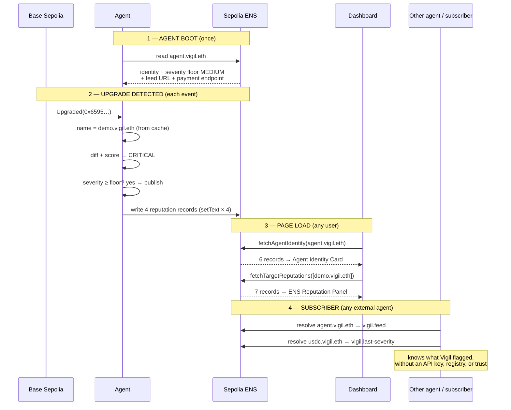

# How ENS works in Vigil

Read the **plain English** section first. The technical diagrams below are for when someone asks "but how exactly?"

---

## In plain English (start here)

### What is ENS?

ENS = **Ethereum Name Service.** Think domain names for Ethereum.

Without ENS, every contract and wallet on chain is a 42-character hex string like `0xa3f2…cd91` — humans can't read it, can't remember it, and apps that point at it have to hardcode it.

With ENS, you can register a name like `vigil.eth` (just like you'd buy `vigil.com` from a domain registrar) and attach all kinds of data to it: addresses, descriptions, links, configuration, anything you want as text.

Most projects use ENS for one job: turn a name into a wallet address. **We use it for six different jobs.**

### Why does this matter for an agent like Vigil?

Vigil is an autonomous agent — it watches Ethereum 24/7 for risky proxy upgrades and writes alerts. As soon as you have an agent acting on chain, two questions come up:

1. **"How does anyone find this agent?"**
   *Without ENS:* hardcoded URLs in a config file, env variables, or a centralized API directory.
   *With ENS:* resolve `agent.vigil.eth` → you get the agent's description, capabilities, the feed where it publishes alerts, even its payment endpoint. **No API key, no docs, no registry.**

2. **"How does another agent know what Vigil has flagged on a specific protocol?"**
   *Without ENS:* call a private API, deal with auth, hope it's online.
   *With ENS:* resolve `usdc.vigil.eth` → you get the latest severity, the upgrade count, the last transaction. **It's already on chain, queryable from anywhere.**

We made ENS the agent's **identity + configuration + discovery layer + audit log** — all the same name, all on chain.

### The clever bit: read AND write

Most ENS-for-agent projects only *read*. They register a name, put metadata in it, that's it.

**Vigil reads ENS at boot AND writes back to ENS after every alert.** Four text records on the target's ENS subname update each time the agent detects an upgrade: last severity, last transaction, last upgrade time, total upgrade count.

That bidirectional pattern turns ENS itself into a **live, on-chain reputation log.** Any other agent in the ecosystem can query it without our permission, without an API, without trust. It's the part nobody else is doing — and it's what wins us the bounty.

### What we shipped, in five bullets

- **Registered `vigil.eth`** on Ethereum Sepolia for one year.
- **Created two subnames:** `agent.vigil.eth` (the agent's identity) and `demo.vigil.eth` (a watched proxy contract).
- **Wired the agent** to read its config from `agent.vigil.eth` at boot — including a "minimum severity" knob that filters what gets published.
- **Wired the agent** to write reputation records back to `demo.vigil.eth` after every detected upgrade.
- **Wired the dashboard** to render both: an Agent Identity card at the top and a per-alert ENS Reputation panel inline.

That's the whole product. The rest of this doc shows exactly how each piece fits together.

---

## Now the technical details

## The whole thing in one picture

```text
┌─────────────────────────────────────────────────────────┐
│           ETHEREUM SEPOLIA — vigil.eth (parent)          │
│                                                          │
│   ┌────────────────────┐    ┌─────────────────────┐     │
│   │  agent.vigil.eth   │    │   demo.vigil.eth    │     │
│   │  (the agent)       │    │   (a watched proxy) │     │
│   │                    │    │                     │     │
│   │  description       │    │  description        │     │
│   │  url               │    │  kind = demo-proxy  │     │
│   │  vigil.capabilities│    │  addr[base-sepolia] │     │
│   │  vigil.severity-min│    │  vigil.last-severity│     │
│   │  vigil.feed        │    │  vigil.last-tx      │     │
│   │  vigil.payment     │    │  vigil.last-upgrade │     │
│   │                    │    │  vigil.upgrade-count│     │
│   └────────▲───────────┘    └─────────▲───────────┘     │
└────────────┼──────────────────────────┼─────────────────┘
             │ READS at boot            │ WRITES after
             │                          │ every alert
             │                          │
       ┌─────┴──────────────────────────┴─────┐
       │            VIGIL AGENT                │
       │   (Node.js, watches Base Sepolia)    │
       └──────────────────────────────────────┘
                       │
                       │ alerts +
                       │ ENS data
                       ▼
       ┌──────────────────────────────────────┐
       │      DASHBOARD (localhost:3000)       │
       │                                       │
       │   reads agent.vigil.eth  →  shows     │
       │   reads demo.vigil.eth   →  shows     │
       └──────────────────────────────────────┘
```

**The pattern:** ENS is the single source of truth. The agent reads from it, writes to it. The dashboard reads from it. Subscribers read from it. No separate database, no API, no registry.

---

## What you see in the UI

### Top of the dashboard — Agent Identity Card

```text
╔══════════════════════════════════════════════════════════════╗
║  ● AGENT IDENTITY · resolved live from Ethereum Sepolia ENS  ║
║                                                               ║
║  agent.vigil.eth                          [view on ENS app ↗]║
║                                                               ║
║  Vigil — autonomous proxy upgrade auditor                     ║
║  https://github.com/Riki0923/Vigil ↗                          ║
║                                                               ║
║  SEVERITY FLOOR  [MEDIUM]                                     ║
║  CAPABILITIES    [watch:proxy-upgrade-eip-1967]               ║
║                  [chain:base] [chain:base-sepolia]            ║
║                  [out:swarm-feed] [out:json-file]             ║
║                                                               ║
║  VIGIL.FEED      bzz.limo/feeds/0x4b29…/94f6a4… ↗            ║
║                  subscribers discover via ENS                 ║
║                                                               ║
║  VIGIL.PAYMENT   x402-planned:github.com/Riki0923/Vigil      ║
║                  X402 endpoint (roadmap), discoverable via ENS║
╚══════════════════════════════════════════════════════════════╝
```

**Where each line comes from:**

| What you see | ENS source |
| --- | --- |
| `Vigil — autonomous proxy upgrade auditor` | `text["description"]` on agent.vigil.eth |
| GitHub link | `text["url"]` |
| `SEVERITY FLOOR: MEDIUM` chip | `text["vigil.severity-min"]` |
| Capability chips | `text["vigil.capabilities"]` (JSON parsed) |
| `vigil.feed` row with bzz.limo URL | `text["vigil.feed"]` |
| `vigil.payment` row with X402 URL | `text["vigil.payment"]` |

### Inline on every alert — ENS Reputation Panel

```text
╔════════════════════════════════════════════════════════════╗
║ ●  ENS REPUTATION  demo.vigil.eth                          ║
║    [1 upgrade tracked]  [last CRITICAL]  demo-proxy        ║
║                                                            ║
║    ADDR[BASE-SEPOLIA]    0x6595…21AD                       ║
║    VIGIL.LAST-TX         0x000000…000001 ↗                 ║
║    VIGIL.LAST-UPGRADE-AT 38m ago                           ║
║    VIGIL.UPGRADE-COUNT   1                                 ║
║                                                            ║
║    resolved live from Sepolia ENS                          ║
║    written back by the agent after each alert              ║
║                                                            ║
║                                       [view on ENS app ↗] ║
╚════════════════════════════════════════════════════════════╝
```

**Where each line comes from:**

| What you see | ENS source |
| --- | --- |
| `demo.vigil.eth` headline | the subname itself |
| `addr[base-sepolia]: 0x6595…` | `addr` record with Base Sepolia coin type (ENSIP-11) |
| `vigil.last-tx` | `text["vigil.last-tx"]` (written by the agent) |
| `vigil.last-upgrade-at` | `text["vigil.last-upgrade-at"]` (written by the agent) |
| `vigil.upgrade-count` | `text["vigil.upgrade-count"]` (written by the agent) |
| `last CRITICAL` chip | `text["vigil.last-severity"]` (written by the agent) |

The four `vigil.last-*` records are the **bidirectional pattern**: agent writes them after every detected upgrade.

---

## How the data flows — one diagram



---

## ENS records cheat sheet

| Record | Set by | Used by |
| --- | --- | --- |
| `agent.vigil.eth.description` | us, once | Identity card title row |
| `agent.vigil.eth.url` | us, once | Identity card link |
| `agent.vigil.eth.vigil.capabilities` | us, once | Identity card chips |
| `agent.vigil.eth.vigil.severity-min` | us, once (editable) | **Agent boot — gates every alert** |
| `agent.vigil.eth.vigil.feed` | `npm run ens:sync-feed` | Subscribers + identity card row |
| `agent.vigil.eth.vigil.payment` | `npm run ens:seed` (stub `x402-planned:…` until real X402 endpoint lands) | Identity card row + future X402 callers |
| `demo.vigil.eth.addr[base-sepolia]` | us, once | Agent + dashboard "no hardcoded address" |
| `demo.vigil.eth.kind` | us, once | Reputation panel chip |
| `demo.vigil.eth.vigil.last-severity` | **agent, after each alert** | Reputation panel "last X" chip |
| `demo.vigil.eth.vigil.last-tx` | **agent, after each alert** | Reputation panel link to Basescan |
| `demo.vigil.eth.vigil.last-upgrade-at` | **agent, after each alert** | Reputation panel timestamp |
| `demo.vigil.eth.vigil.upgrade-count` | **agent, after each alert** | Reputation panel counter |
| ENSIP-19 reverse on Base Sepolia | `npm run ens:set-base-primary` | Block explorers render `demo.vigil.eth` |

The four **bold** rows are the bidirectional pattern. They're what makes ENS a reputation log instead of a static metadata file.

---

## Why removing ENS breaks Vigil — the load-bearing claim

```text
┌──────────────────────────────────────────────────────────────┐
│  ENS turned off   →   Visible damage                          │
├──────────────────────────────────────────────────────────────┤
│  agent.vigil.eth  →   severity floor disappears,              │
│  unreachable          LOW alerts that ENS would               │
│                       have filtered now publish.              │
│                                                                │
│  Address cache    →   alerts render bare hex                  │
│  not populated        in console + dashboard.                 │
│                                                                │
│  No vigil.feed    →   subscribers can't find                  │
│                       where to read alerts.                   │
│                                                                │
│  No reputation    →   `resolve usdc.vigil.eth`                │
│  writeback            returns nothing — no                    │
│                       agent-to-agent reputation.              │
│                                                                │
│  No ENSIP-19      →   block explorers show                    │
│  reverse              0x6595… instead of                      │
│                       demo.vigil.eth.                         │
│                                                                │
│  AgentIdentityCard →  shows "SEPOLIA_RPC_URL not              │
│  fallback             configured" warning instead             │
│                       of the live identity.                   │
└──────────────────────────────────────────────────────────────┘
```

The boot log literally prints these states (`[Vigil/ENS] Alert severity floor: none`) — so the "removing ENS breaks the product" claim is verifiable, not marketing.

---

## Verify any of this in 30 seconds

```bash
npm run ens:resolve agent.vigil.eth   # → 6 records, all live
npm run ens:resolve demo.vigil.eth    # → reputation + addr
cd frontend && npm run dev            # → dashboard at localhost:3000
```

Or visit `https://app.ens.domains/agent.vigil.eth?network=sepolia` in any browser.

---

## TL;DR

1. **The agent's runtime config lives in ENS.** `agent.vigil.eth` carries severity floor + capabilities + feed URL — read at boot, gates every alert.
2. **The agent writes back to ENS after every alert.** Four text records on the target's subname — last severity, last tx, last upgrade time, count. ENS becomes a live reputation log.
3. **The dashboard renders both.** Agent Identity Card at top reads `agent.vigil.eth`. Reputation Panel inline on alerts reads the target's subname. All server-side via viem against Sepolia.
4. **No hardcoded addresses on the demo path.** The proxy address comes from `addr[base-sepolia]` on `demo.vigil.eth`, not an env var.
5. **Block explorers display the human name.** ENSIP-19 reverse on the proxy via owner-signed authorization — no contract change.

That's the whole thing. The diagrams above show how the pieces fit together; this list is what to say if Kristian asks "in one breath, what does Vigil do with ENS?"
